# Architecture Governance: Human-AI Decision Framework

```yaml
document_type: architecture_decision_record
diataxis: explanation
version: 2.0.0
date: 2026-02-16
audience: [architects, tech_leads, security_engineers, compliance_officers]
ai_ready: true
related_adrs: [ADR-014, ADR-015, ADR-016]
slos:
  veto_window_availability: 99.99%
  notification_latency_p99: <5s
  audit_log_durability: 100%
```

---

## 🎯 Executive Summary

This document defines Auto-Broker's **asymmetric governance architecture** implementing two distinct human supervision patterns:

| Pattern | Agent | Use Case | Latency | Risk Profile |
|---------|-------|----------|---------|--------------|
| **Human-on-the-loop** | PAOLO | Time-critical operations | ~60s veto window | Medium risk, high velocity |
| **Human-in-the-loop** | GIULIA | High-impact decisions | Async (minutes-hours) | High risk, high accuracy |

```mermaid
graph TB
    subgraph "Decision Architecture"
        P[PAOLO<br/>⚡ Fast]
        G[GIULIA<br/>🤔 Deliberate]
    end
    
    subgraph "Human Supervision"
        HOT[Hot-Standby<br/>60s Window]
        HIL[Pre-Authorization<br/>Await Approval]
    end
    
    subgraph "Execution"
        AUTO[Auto-Execute]
        VETO[Veto Possible]
        AUTH[Requires Auth]
    end
    
    P --> HOT --> VETO --> AUTO
    G --> HIL --> AUTH
```



---

## 🏗️ Architectural Overview

### C4 Level 3: Component Diagram


### State Machines

#### PAOLO: Human-on-the-loop


#### GIULIA: Human-in-the-loop


---

## 📡 API Reference

### Open Veto Window

```http
POST /api/v1/governance/veto/window/open
Content-Type: application/json
Authorization: Bearer ${AGENT_TOKEN}
X-Request-ID: ${UUID}

{
  "decision_id": "550e8400-e29b-41d4-a716-446655440000",
  "agent_type": "PAOLO",
  "operation_type": "carrier_failover",
  "context": {
    "shipment_id": "SHIP-2847",
    "carrier_id": 123,
    "amount_eur": 5000.00,
    "confidence_score": 0.92,
    "reasoning_hash": "sha256:abc..."
  },
  "policy_override": null
}
```

**Response (201 Created)**
```json
{
  "window_id": "550e8400-e29b-41d4-a716-446655440001",
  "status": "open",
  "mode": "human_on_the_loop",
  "expires_at": "2026-02-16T14:30:00Z",
  "time_remaining_ms": 60000,
  "dashboard_url": "/war-room/veto/550e8400-e29b-41d4-a716-446655440001"
}
```

### Exert Veto

```http
POST /api/v1/governance/veto/window/{window_id}/veto
Content-Type: application/json
Authorization: Bearer ${OPERATOR_TOKEN}

{
  "operator_id": "uuid",
  "rationale": "Carrier has positive history on this lane, wait for verification",
  "veto_type": "temporary",
  "duration_minutes": 30
}
```

**Response (200 OK)**
```json
{
  "window_id": "uuid",
  "status": "vetoed",
  "exerted_at": "2026-02-16T14:29:15Z",
  "remaining_time_ms": 45000,
  "rollback_initiated": true,
  "cascade_applied": false
}
```

### Approve Decision (GIULIA)

```http
POST /api/v1/governance/veto/window/{window_id}/approve
Content-Type: application/json
Authorization: Bearer ${OPERATOR_TOKEN}

{
  "operator_id": "uuid",
  "override_reason": null,
  "four_eyes_code": "xyz789",
  "notes": "Verified with customer, proceed with refund"
}
```

### Query Status

```http
GET /api/v1/governance/veto/window/{window_id}/status
Authorization: Bearer ${TOKEN}
```

**Response**
```json
{
  "window_id": "uuid",
  "status": "open",
  "agent": "PAOLO",
  "time_remaining_ms": 23450,
  "context_summary": {
    "shipment_id": "SHIP-2847",
    "action": "change_carrier",
    "from_carrier": "Carrier A",
    "to_carrier": "Carrier B",
    "amount_eur": 7500
  },
  "notifications_sent": 3,
  "escalation_level": "primary"
}
```

---

## 🎛️ Decision Matrix

### PAOLO: Carrier Failover Decision Table

```yaml
policy_version: "2.0.0"
paolo_thresholds:
  full_auto:
    max_amount_eur: 5000
    mode: "FULL_AUTO"
    notification: "log_only"
    
  hot_standby:
    max_amount_eur: 10000
    min_confidence: 0.80
    mode: "HUMAN_ON_THE_LOOP"
    timeout_seconds: 60
    notification: "push_standard"
    
  human_in_loop:
    max_amount_eur: 50000
    mode: "HUMAN_IN_THE_LOOP"
    timeout_seconds: null
    notification: "push_urgent_sms"
    
  dual_control:
    min_amount_eur: 50000
    mode: "DUAL_CONTROL"
    approvers_required: 2
    notification: "war_room_voice"
```

| Amount | Confidence | Mode | Timeout | Channels | Escalation |
|--------|------------|------|---------|----------|------------|
| < €5k | Any | Full-Auto | N/A | Log | None |
| €5k-€10k | > 80% | Hot-Standby | 60s | Push | Backup @ 30s |
| €5k-€10k | < 80% | Human-in-loop | ∞ | Push + Email | Senior @ 1h |
| €10k-€50k | Any | Human-in-loop | ∞ | Push + SMS | War Room @ 30m |
| > €50k | Any | Dual Control | ∞ | Voice + War Room | Exec @ 1h |

### GIULIA: Dispute Resolution Decision Table

```yaml
giulia_thresholds:
  full_auto:
    max_amount_eur: 1000
    min_confidence: 0.95
    mode: "FULL_AUTO"
    
  fast_track:
    max_amount_eur: 3000
    min_confidence: 0.95
    mode: "HUMAN_ON_THE_LOOP"
    timeout_seconds: 60
    
  standard:
    max_amount_eur: 10000
    mode: "HUMAN_IN_THE_LOOP"
    sla_hours: 4
    
  senior_review:
    min_amount_eur: 10000
    mode: "DUAL_CONTROL"
    sla_hours: 24
    requires_senior: true
```

| Amount | Confidence | Mode | Timeout | SLA | Approvers |
|--------|------------|------|---------|-----|-----------|
| < €1k | > 95% | Full-Auto | N/A | N/A | 0 |
| €1k-€3k | > 95% | Hot-Standby | 60s | 1h | 1 |
| €1k-€3k | < 95% | Human-in-loop | ∞ | 4h | 1 |
| €3k-€10k | Any | Human-in-loop | ∞ | 4h | 1 |
| > €10k | Any | Dual Control | ∞ | 24h | 2 (1 senior) |

### Contextual Overrides


---

## 🖥️ War Room Dashboard

### Real-Time Interface

```mermaid
mockup
    title War Room Command Center
    
    header [🟢 Online] [⚡ 3 Urgent] [🕐 14:32 UTC]
    
    section "Active Veto Windows" {
        card PAOLO-2847 {
            status: 🟡 COUNTING DOWN
            shipment: SH-2847
            action: Failover €7,500
            remaining: 45s
            buttons: [🛑 VETO] [✓ ALLOW] [⏱ EXTEND]
        }
        
        card GIULIA-893 {
            status: 🟢 AWAITING APPROVAL
            dispute: DISP-4451
            amount: €15,000
            confidence: 87%
            queue_time: 12m
            buttons: [👁 REVIEW] [✓ APPROVE] [✗ REJECT]
        }
    }
    
    section "Risk Heatmap" {
        heatmap {
            x: Economic Value (log)
            y: Time Remaining
            red_zone: >€10k + <10s
            yellow_zone: €5-10k OR 10-30s
            green_zone: <€5k + >30s
        }
    }
    
    section "Quick Actions" {
        big_button [🛑 EMERGENCY STOP]
        stats {
            vetos_today: 3
            avg_response: 18s
            auto_executed: 47
        }
    }
```

### SSE Event Stream

```javascript
// Connection: GET /api/v1/governance/war-room/events
// Headers: Accept: text/event-stream

event: veto.window.opened
data: {
  "window_id": "uuid",
  "agent": "PAOLO",
  "shipment_id": "SH-2847",
  "amount_eur": 7500,
  "countdown_seconds": 60,
  "urgency": "high",
  "dashboard_url": "/war-room/veto/uuid"
}

event: veto.window.closing
data: {
  "window_id": "uuid",
  "time_remaining_ms": 10000,
  "status": "no_veto_received",
  "will_auto_execute": true
}

event: veto.window.vetoed
data: {
  "window_id": "uuid",
  "operator": {"id": "uuid", "name": "M. Rossi"},
  "rationale": "Wait for carrier verification",
  "rollback_initiated": true
}
```

---

## 📢 Notification System

### Multi-Channel Routing

```yaml
notification_profiles:
  paolo_low:
    channels: [in_app]
    priority: low
    sound: false
    vibration: false
    
  paolo_standard:
    channels: [push, in_app]
    priority: high
    sound: true
    vibration: true
    smartwatch: true
    
  paolo_urgent:
    channels: [push, sms, voice]
    priority: critical
    sound: urgent
    vibration: true
    bypass_dnd: true
    
  giulia_standard:
    channels: [email, in_app]
    priority: normal
    
  giulia_urgent:
    channels: [push, email]
    priority: high
    sound: true
```

### Escalation Sequence


---

## 🔐 Audit & Compliance

### Immutable Audit Schema

```json
{
  "audit_id": "550e8400-e29b-41d4-a716-446655440002",
  "timestamp_utc": "2026-02-16T14:30:00Z",
  "event_type": "veto.exerted",
  "schema_version": "2.0.0",
  
  "decision_context": {
    "window_id": "uuid",
    "agent_type": "PAOLO",
    "operation": "carrier_failover",
    "shipment_id": "SHIP-2847",
    "amount_eur": 7500.00,
    "confidence_score": 0.92,
    "model_version": "paolo-v2.3"
  },
  
  "ai_rationale": {
    "reasoning_hash": "sha256:abc...",
    "evidence_hashes": ["ipfs:Qm..."],
    "alternative_rejected": "carrier_456"
  },
  
  "human_interaction": {
    "operator_id": "uuid",
    "operator_name": "Mario Rossi",
    "action": "veto",
    "timestamp": "2026-02-16T14:29:15Z",
    "rationale": "Wait for carrier verification",
    "time_to_decision_ms": 45000,
    "ip_address": "10.0.1.100",
    "device_fingerprint": "sha256:xyz..."
  },
  
  "gdpr_article22": {
    "significant_decision": true,
    "human_supervised": true,
    "right_to_contest": true,
    "explanation_provided": true,
    "automated_decision": false
  },
  
  "outcome": {
    "final_state": "vetoed",
    "rollback_executed": true,
    "compensation_tx_hash": null,
    "pattern_logged": true
  },
  
  "integrity": {
    "previous_audit_hash": "sha256:prev...",
    "signature": "sha256:sig..."
  }
}
```

### GDPR Article 22 Compliance

| Requirement | Implementation | Evidence |
|-------------|----------------|----------|
| **Art. 22** - Right to human review | Human-in-the-loop for GIULIA | `operator_id` in audit |
| **Art. 13/14** - Transparency | Decision Package with reasoning | `evidence_hash` in audit |
| **Art. 15** - Access | `/audit/{id}` endpoint | API documented |
| **Art. 16** - Rectification | Veto enables correction | `veto.event` in log |
| **Art. 17** - Erasure | Anonymization after 7 years | `retention_policy` config |

---

## ⚙️ Dynamic Configuration

### Runtime Policy Updates

```http
GET /api/v1/governance/config
Authorization: Bearer ${ADMIN_TOKEN}
```

**Response**
```json
{
  "version": "2.0.0",
  "updated_at": "2026-02-16T10:00:00Z",
  "updated_by": "admin@autobroker.com",
  
  "paolo": {
    "thresholds": {
      "full_auto_max_eur": 5000,
      "hot_standby_max_eur": 10000,
      "human_in_loop_max_eur": 50000,
      "dual_control_min_eur": 50000
    },
    "timeouts": {
      "veto_window_seconds": 60,
      "escalation_first_reminder_seconds": 15,
      "escalation_backup_seconds": 30
    },
    "business_hours": {
      "timezone": "Europe/Rome",
      "weekdays": "09:00-18:00",
      "weekend": "emergency_only",
      "holidays": "human_in_loop_for_all"
    }
  },
  
  "giulia": {
    "thresholds": {
      "full_auto_max_eur": 1000,
      "fast_track_confidence_min": 0.95,
      "fast_track_max_eur": 3000
    },
    "sla": {
      "standard_hours": 4,
      "escalation_senior_hours": 24
    }
  }
}
```

### Hot Reload

```python
# Configuration change event
@on_config_change(topic="governance.policy")
async def update_policies(event: ConfigChangeEvent):
    """Hot reload policies without restart."""
    
    # Update in-memory cache
    await policy_cache.atomic_update(event.new_config)
    
    # Notify all agents
    await event_bus.publish(
        "policy.updated",
        {
            "version": event.version,
            "changes": event.diff,
            "effective_at": event.timestamp
        }
    )
    
    # Audit the change
    await audit.log_config_change(
        old_value=event.previous_config,
        new_value=event.new_config,
        operator_id=event.operator_id,
        rationale=event.rationale
    )
```

---

## 🚨 Safety & Fallback

### Circuit Breaker Matrix

| Condition | PAOLO Behavior | GIULIA Behavior |
|-----------|----------------|-----------------|
| Dashboard Online | Standard operation | Standard operation |
| Dashboard Offline 30s | Continue auto | Block pending |
| Notifications Down | Log locally, retry | Queue for later |
| Database Unavailable | Buffer to local | Block, alert ops |
| Redis Unavailable | Use DB fallback | Degrade gracefully |

### Emergency Kill Switch

```bash
# Trigger emergency pause
POST /api/v1/governance/emergency/pause-all
Authorization: Bearer ${EMERGENCY_TOKEN}
X-Emergency-Code: ${CODE}

{
  "reason": "Suspected system compromise",
  "operator_id": "uuid",
  "estimated_duration_minutes": 60
}
```

**Effects:**
- PAOLO: All operations → Human-in-the-loop
- GIULIA: All decisions → Await senior review
- Notifications: War Room + Voice call

**Recovery:**
- Requires 2 senior operators
- Manual reset with rationale
- Full audit trail

### Dual Control Implementation

```python
class DualControlService:
    """Four-eyes principle for high-risk decisions."""
    
    async def request_approval(
        self,
        decision: Decision,
        required_approvers: int = 2
    ) -> ApprovalResult:
        
        approvals = []
        
        for i in range(required_approvers):
            approval = await self.await_approval(
                decision_id=decision.id,
                operator_pool="senior_ops",
                exclude_operators=[a.operator_id for a in approvals],
                timeout_hours=2,
                require_different_ip=(i > 0)  # Second approver different location
            )
            
            if not approval:
                return ApprovalResult(status=ApprovalStatus.TIMEOUT)
            
            approvals.append(approval)
        
        # All approvers must agree
        if all(a.action == "approve" for a in approvals):
            return ApprovalResult(
                status=ApprovalStatus.APPROVED,
                approvers=approvals
            )
        else:
            return ApprovalResult(
                status=ApprovalStatus.REJECTED,
                approvers=approvals
            )
```

---

## 📈 Rollout Plan

### Phased Deployment


### Advancement Criteria

| Phase Transition | Criteria | Target Metric |
|------------------|----------|---------------|
| 1 → 2 | AI Accuracy | > 95% (FP < 5%) |
| 2 → 3 | Veto Rate | < 20% |
| 3 → 4 | Approval Time | < 2h (90% within SLA) |
| 4 → 5 | Error Rate | < 0.1% |

---

## 📊 Observability

### SLOs and SLIs

| SLO | Target | Measurement |
|-----|--------|-------------|
| Veto Window Availability | 99.99% | Uptime of veto service |
| Notification Latency (p99) | < 5s | Time to first notification |
| Audit Log Durability | 100% | Zero audit record loss |
| Decision Latency (PAOLO) | < 100ms | API response time |
| Human Response Time | < 30s | Median veto time |

### Key Metrics

```prometheus
# Veto window metrics
governance_veto_windows_total{agent="PAOLO", outcome="auto_executed"}
governance_veto_windows_total{agent="PAOLO", outcome="vetoed"}
governance_veto_duration_seconds_bucket{agent="PAOLO", le="30"}

# Decision quality
governance_decision_accuracy_ratio{agent="GIULIA"}
governance_false_positive_rate{agent="PAOLO"}

# Human factors
governance_human_response_time_seconds{percentile="p50"}
governance_escalation_rate{reason="timeout"}
```

---

## 📚 References

### Standards
- [ISO 27001:2022](https://www.iso.org/standard/27001) - Security Controls
- [GDPR Article 22](https://gdpr-info.eu/art-22-gdpr/) - Automated Decision Making
- [NIST AI RMF](https://www.nist.gov/itl/ai-risk-management-framework) - AI Risk Management

### Internal ADRs
- [ADR-014: Confidential Computing](./adr/ADR-014-confidential-computing.md)
- [ADR-015: Self-Healing Supply Chain](./adr/ADR-015-self-healing-supply-chain.md)
- [ADR-016: Human-AI Governance](./adr/ADR-016-human-ai-governance.md)

### External Resources
- [Google SRE Book - Emergency Response](https://sre.google/sre-book/managing-incidents/)
- [Netflix Tech Blog - Human-in-the-loop](https://netflixtechblog.com/)
- [Stripe API Design Guide](https://stripe.com/docs/api)

---

## 📝 Glossary

| Term | Definition |
|------|------------|
| **Human-on-the-loop** | System acts immediately; human can intervene (veto) within time window |
| **Human-in-the-loop** | System awaits human approval before acting |
| **Veto Window** | Time period during which human can block an initiated action |
| **Decision Package** | AI analysis, context, and recommendation presented to operator |
| **Four-eyes Principle** | Two independent approvers required for high-risk operations |
| **Hot-Standby** | Supervisor on alert but execution not blocked |
| **Cascade Veto** | Veto automatically applied to similar future patterns |

---

```yaml
metadata:
  version: 2.0.0
  last_updated: 2026-02-16
  owner: platform-team@autobroker.com
  approvers: [cto, chief_architect, compliance_officer]
  next_review: 2026-03-16
  
documentation_metrics:
  reading_time_minutes: 25
  code_examples: 12
  diagrams: 8
  api_endpoints: 5
```