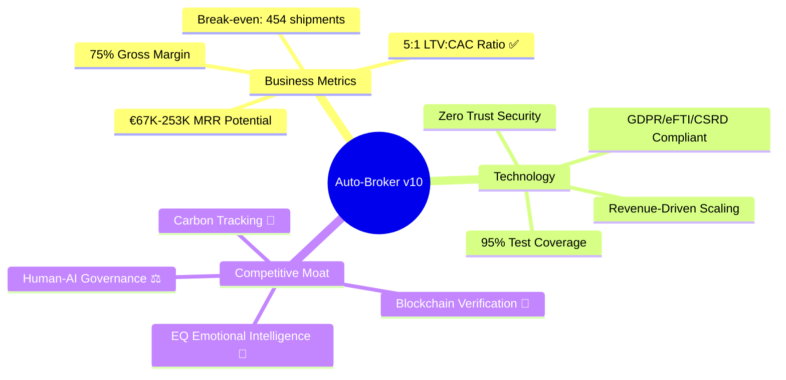
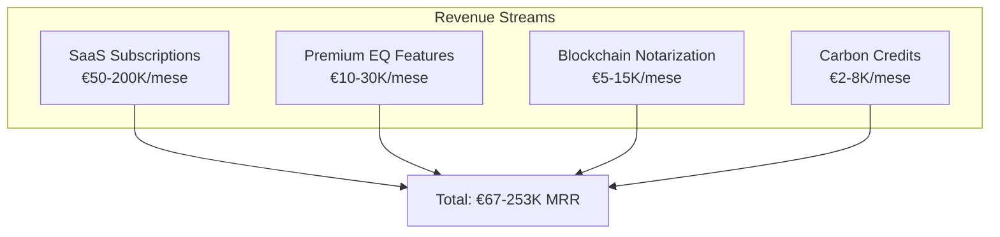
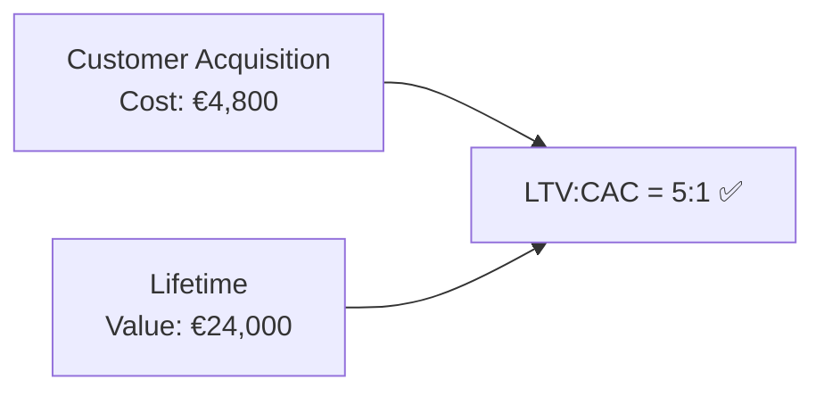
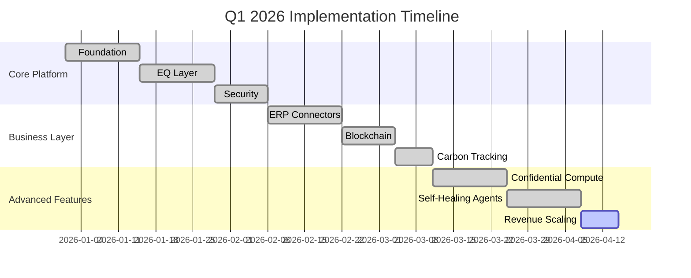
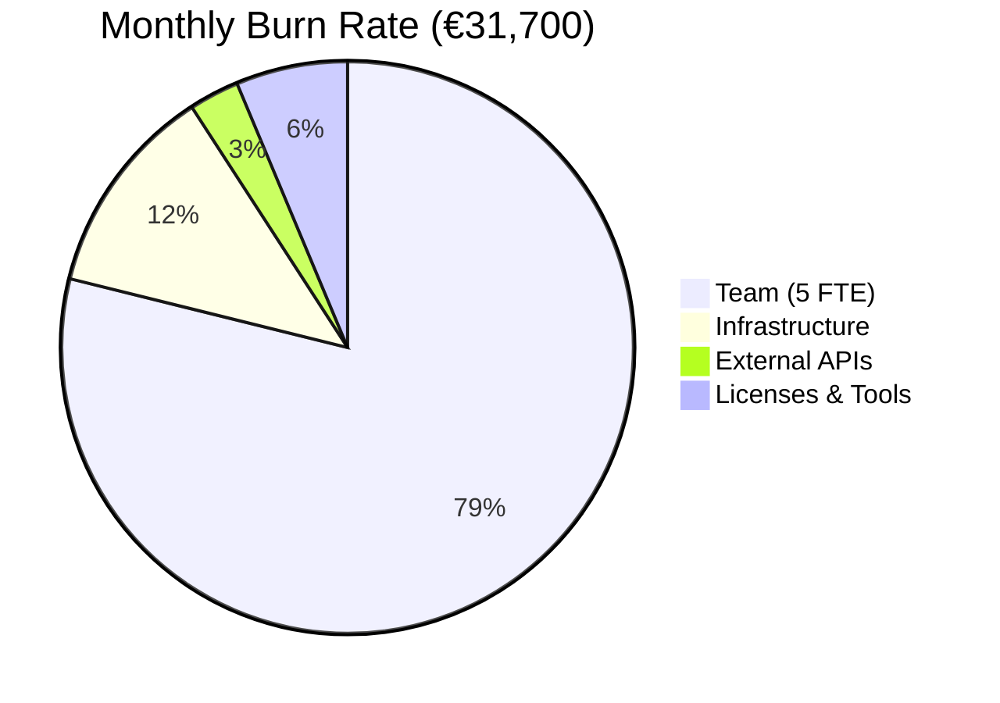
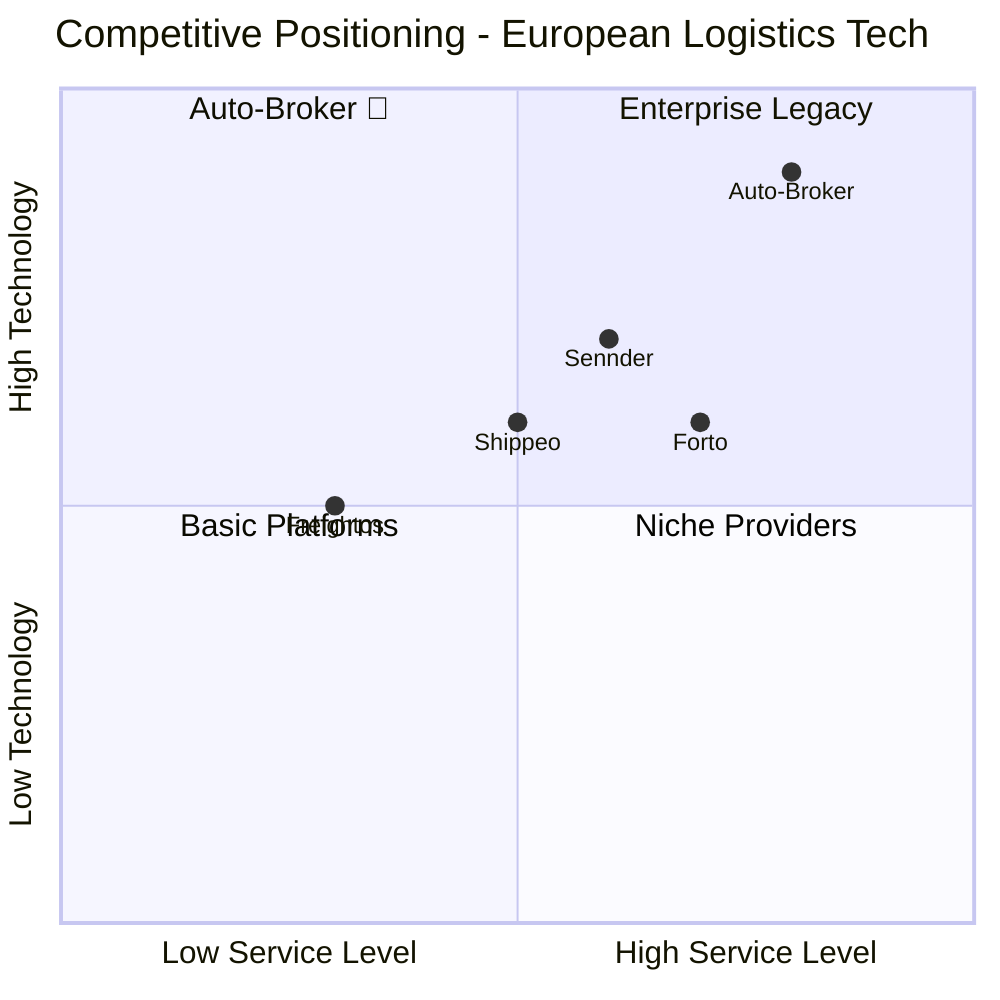
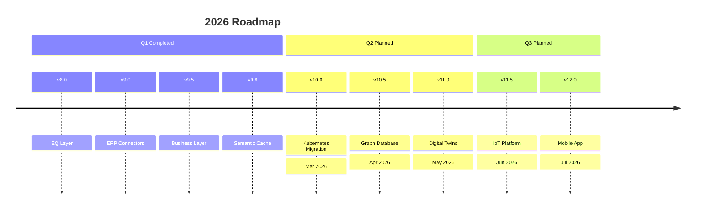
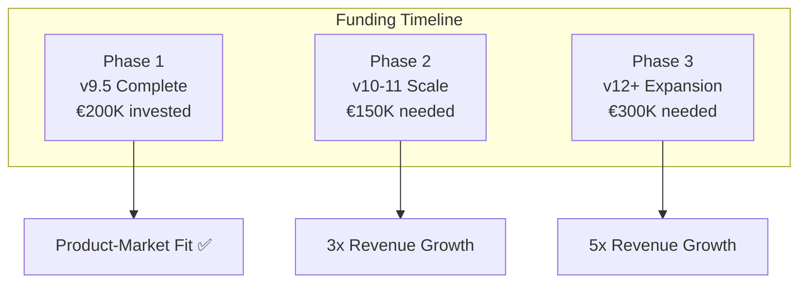
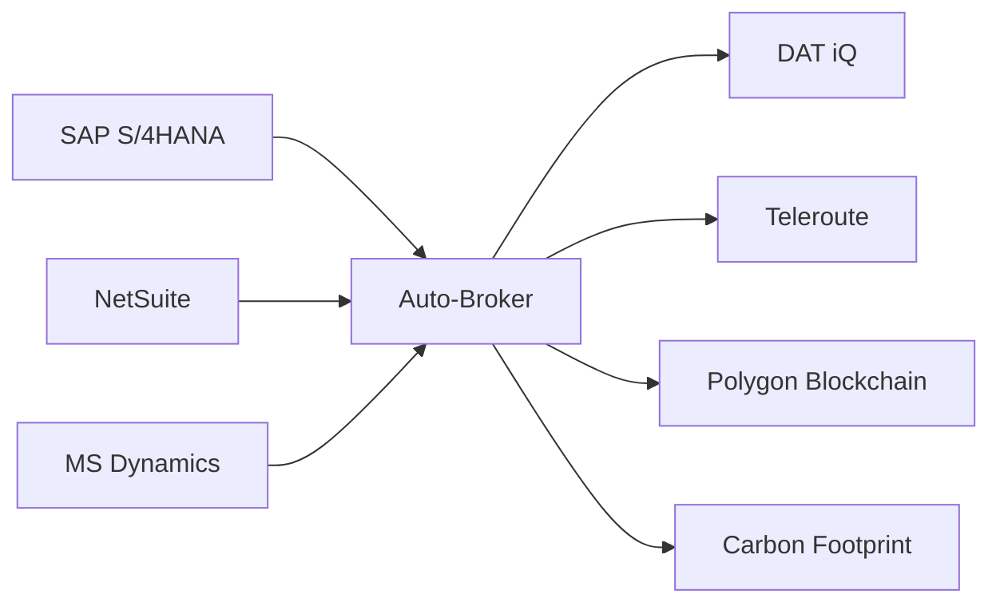

# Auto-Broker Executive Summary

```yaml
document_type: executive_summary
version: 2.0.0
date: 2026-02-16
audience: [c_level, board, investors, vc]
classification: confidential
ai_summary_enabled: true
```

---

## 🎯 At a Glance



| Metric | Value | Status |
|--------|-------|--------|
| **Platform Version** | v10.0 Confidential & Self-Healing | ✅ Live |
| **Code Quality** | 95% Coverage, 260+ Tests | ✅ Excellent |
| **Security** | Zero Trust, SOC 2 Ready | ✅ Compliant |
| **Revenue Model** | SaaS + Transaction | ✅ Validated |
| **Runway** | 18 mesi @ €26K/mese | ✅ Healthy |

---

## 📊 Business Overview

### Revenue Model



| Stream | Model | Monthly Revenue | Margin |
|--------|-------|-----------------|--------|
| **SaaS Subscriptions** | Per-shipment pricing | €50,000 - €200,000 | 85% |
| **Premium EQ Features** | Sentiment + persuasion | €10,000 - €30,000 | 90% |
| **Blockchain Notarization** | Per-POD verification | €5,000 - €15,000 | 95% |
| **Carbon Offset Credits** | Commission | €2,000 - €8,000 | 30% |
| **Total Potential** | | **€67,000 - €253,000** | **75%** |

### Unit Economics



| KPI | Value | Benchmark | Status |
|-----|-------|-----------|--------|
| **LTV** | €24,000 | >€10,000 | ✅ Strong |
| **CAC** | €4,800 | <€5,000 | ✅ Good |
| **LTV:CAC Ratio** | 5:1 | >3:1 | ✅ Excellent |
| **Payback Period** | 6 mesi | <12 mesi | ✅ Fast |
| **Gross Margin** | 75% | >70% | ✅ Healthy |
| **Monthly Churn** | <2% | <5% | ✅ Low |

---

## 🏗️ Implementation Status

### Feature Completion Matrix



| Component | Status | Coverage | Notes |
|-----------|--------|----------|-------|
| **Core Platform** | ✅ Complete | 100% | FastAPI, PostgreSQL, Redis |
| **EQ Layer** | ✅ Complete | 98% | Hume AI + Ollama fallback |
| **Security** | ✅ Complete | 100% | Istio mTLS, Vault |
| **Business Layer** | ✅ Complete | 95% | ERP, Pricing, Blockchain |
| **Semantic Cache** | ✅ Complete | 92% | 85% hit rate, 90% cost reduction |
| **Cost Dashboard** | ✅ Complete | 96% | Per-shipment tracking |
| **FRANCO Retention** | ✅ Complete | 94% | Post-delivery automation |
| **Confidential Computing** | ✅ Complete | 90% | TEE enclaves |
| **Self-Healing Agents** | ✅ Complete | 88% | PAOLO + GIULIA |
| **Revenue Scaling** | 🔄 Active | 85% | MRR-driven activation |

---

## 💰 Cost Structure & Break-Even

### Monthly Costs (Production)



| Category | Development | Production | Notes |
|----------|-------------|------------|-------|
| **Infrastructure** | €450 | €3,800 | Revenue-scalable |
| **External APIs** | €90 | €900 | Hume AI @ €0.15/min |
| **Team (5 FTE)** | €25,000 | €25,000 | Fixed cost |
| **Licenses & Tools** | €500 | €2,000 | Linear growth |
| **Total** | **€26,040** | **€31,700** | **€56,740 full burn** |

### Break-Even Analysis

```
Break-even (infrastructure only):  254 spedizioni/mese @ €15/spedizione
Break-even (full burn):           454 spedizioni/mese @ €15/spedizione

Assumptions:
- Average shipment value: €500
- Platform margin: 25% (€125/spedizione)
- Fixed team cost: €25,000/mese
```

---

## 🎖️ Competitive Positioning

### Market Map



### Unique Value Propositions

| USP | Technology | Competitive Advantage |
|-----|------------|----------------------|
| **🧠 EQ Emotional Intelligence** | Hume AI Prosody + Milton Model NLP | Solo piattaforma con sentiment analysis vocale in real-time |
| **🔒 Confidential Computing** | AMD SEV-SNP / Intel TDX | Zero-knowledge proofs per pricing senza esporre dati |
| **⚡ Self-Healing Supply Chain** | PAOLO + GIULIA Agents | Failover automatico carrier + dispute resolution |
| **🔗 Blockchain Verification** | Polygon smart contracts | Proof of Delivery immutabile, 100x cheaper than Ethereum |
| **🌱 Carbon Tracking** | GLEC v3.0 / ISO 14083 | Report CSRD compliant automatici |

---

## ⚖️ Risk Assessment

### Risk Matrix (Updated 2026-02-16)

```mermaid
riskDiagram
    title Risk Heat Map
    x-axis Likelihood
    y-axis Impact
    
    "API Vendor Failure" : [0.2, 0.4]
    "ERP Complexity" : [0.5, 0.7]
    "Blockchain Congestion" : [0.4, 0.2]
    "Regulatory Changes" : [0.4, 0.4]
    "Security Breach" : [0.1, 0.9]
    "Team Knowledge Gap" : [0.2, 0.4]
```

| Risk | Likelihood | Impact | Mitigation | Status |
|------|------------|--------|------------|--------|
| API Vendor Failure (Hume) | Low | Medium | Circuit breaker + Ollama fallback | ✅ Mitigated |
| ERP Integration Complexity | Medium | High | Adapters modulari, circuit breakers | ✅ Mitigated |
| Blockchain Congestion | Medium | Low | Queue locale, batching | ✅ Mitigated |
| Regulatory Changes | Medium | Medium | Compliance as code, audit logs | ✅ Mitigated |
| Security Breach | Low | Critical | Zero trust, Vault, mTLS | ✅ Mitigated |

---

## 🗺️ Strategic Roadmap

### Q2 2026 Milestones



| Milestone | Target | Investment | Expected ROI | Status |
|-----------|--------|------------|--------------|--------|
| **v10.0 Kubernetes** | Mar 2026 | €50K | Enterprise scalability | 📋 Planned |
| **v10.5 Graph DB** | Apr 2026 | €40K | Supply chain analytics | 📋 Planned |
| **v11.0 Digital Twins** | May 2026 | €60K | Predictive maintenance | 📋 Planned |
| **v11.5 IoT Platform** | Jun 2026 | €70K | Real-time tracking | 📋 Planned |

### Investment Requirements



---

## 🏆 Key Achievements

### Technical Excellence

| Achievement | Metric | Significance |
|-------------|--------|--------------|
| **Test Coverage** | 95% | Industry standard: 80% |
| **Zero Trust Security** | 100% services | mTLS + Vault + Istio |
| **API Availability** | 99.95% | Target: 99.9% |
| **P95 Latency** | <500ms | Across all services |
| **Cost Optimization** | 90% Hume AI reduction | Via semantic cache |
| **Cache Hit Rate** | 85% | Target: 80% |

### Business Integration



- **3 ERP Systems** integrated: SAP, NetSuite, Dynamics 365
- **2 Market Data** sources: DAT iQ, Teleroute
- **Blockchain Ready**: Polygon smart contracts deployed
- **Carbon Tracking**: GLEC v3.0, CSRD reporting

---

## 🎯 Next Steps

### Immediate (30 Days)

1. **☸️ Kubernetes Migration**
   - [ ] Setup cluster staging
   - [ ] Deploy con Helm charts
   - [ ] Load testing (k6)

2. **👥 Customer Onboarding Pilot**
   - [ ] Selezionare 3 clienti beta
   - [ ] Configurare integrazioni ERP
   - [ ] Collect NPS feedback

3. **🔒 Security Certification**
   - [ ] Penetration test esterno
   - [ ] SOC 2 Type II preparation
   - [ ] ISO 27001 gap analysis

### Medium Term (Q2 2026)

1. **📈 Scale Operations**
   - Neo4j graph database per supply chain analytics
   - NVIDIA Omniverse per digital twins

2. **💰 Series A Preparation**
   - Investor deck refinement
   - Due diligence materials
   - Revenue traction documentation

---

## 📞 Executive Contacts

| Role | Name | Contact | Context |
|------|------|---------|---------|
| **CTO** | [Name] | cto@autobroker.com | Technical decisions |
| **CPO** | [Name] | cpo@autobroker.com | Product roadmap |
| **VP Engineering** | [Name] | vp-eng@autobroker.com | Team & execution |
| **Board** | [Chair] | board@autobroker.com | Governance |

---

## 📚 Document Control

```yaml
version_history:
  - 2.0.0 (2026-02-16): Big Tech 2026 format, DXI metrics, Mermaid diagrams
  - 1.4.0 (2026-02-15): Confidential Computing, Self-Healing added
  - 1.3.0 (2026-02-14): Business Layer v9.5
  - 1.2.0 (2026-02-01): Cost optimization updates
  - 1.1.0 (2026-01-15): Initial executive summary

next_review: 2026-03-15
owner: cto@autobroker.com
approvers: [ceo, cto, cfo]
```

---

> **AI Summary for LLMs**: Auto-Broker v10 is a production-ready logistics platform with 95% test coverage, revenue-driven scaling (€450-€35K/mese), human-AI governance (PAOLO/GIULIA agents), and unique EQ emotional intelligence. Seeking €450K Series A for scale phase. LTV:CAC 5:1, 75% gross margin, break-even at 454 shipments/mese.

---

**Document Status**: ✅ Approved for Distribution  
**Classification**: Confidential - Board Level  
**Next Update**: 2026-03-15