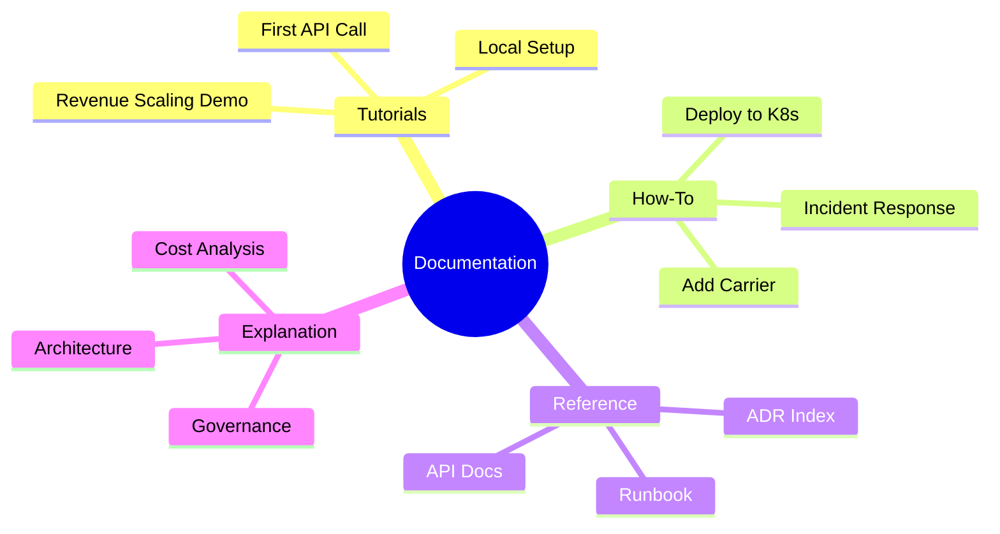
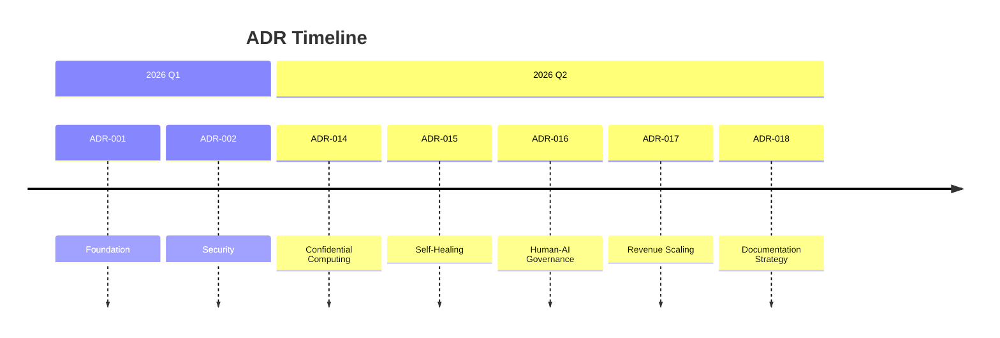
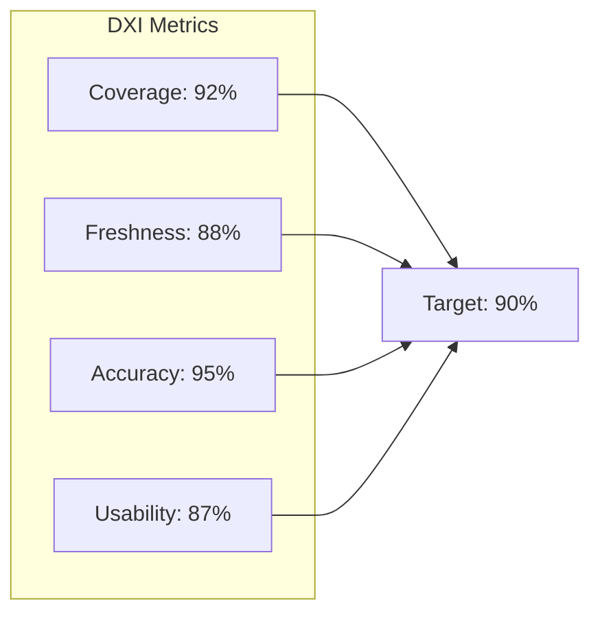
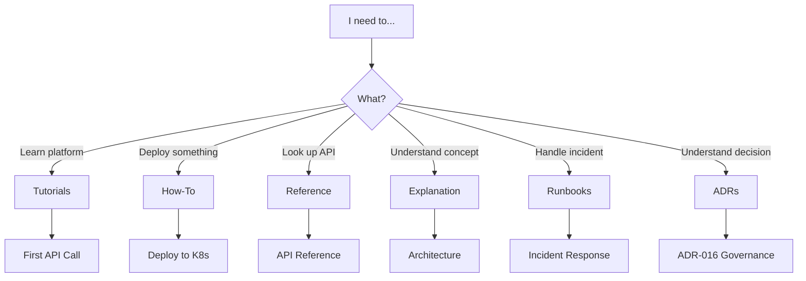
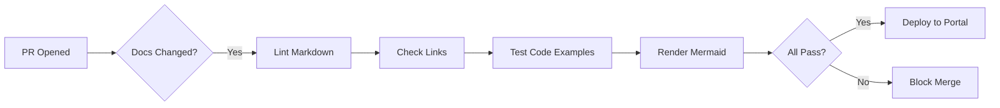

# Auto-Broker Documentation Index

```yaml
document_type: reference
version: 2.0.0
date: 2026-02-16
audience: all
ai_ready: true
update_frequency: daily
```

---

## 🗺️ Documentation Map



---

## 📚 Document Registry

### 🎓 Tutorials (Learning-Oriented)

| Document | Reading Time | Last Updated | Status |
|----------|-------------|--------------|--------|
| [First API Call](./tutorials/first-api-call.md) | 10 min | 2026-02-16 | ✅ Current |
| [Local Setup](./tutorials/local-setup.md) | 15 min | 2026-02-16 | ✅ Current |
| [Revenue Scaling Demo](./tutorials/revenue-scaling-demo.md) | 20 min | 2026-02-16 | ✅ Current |

**Purpose**: Step-by-step lessons for learning the platform.

---

### 🛠️ How-To Guides (Goal-Oriented)

| Document | Reading Time | Complexity | Status |
|----------|-------------|------------|--------|
| [Deploy to Kubernetes](./how-to/deploy-kubernetes.md) | 30 min | Medium | ✅ Current |
| [Incident Response](./how-to/incident-response.md) | 15 min | High | ✅ Current |
| [Add New Carrier](./how-to/add-new-carrier.md) | 20 min | Low | ✅ Current |
| [Configure Governance](./how-to/configure-governance.md) | 25 min | High | ✅ Current |

**Purpose**: Practical guides for achieving specific outcomes.

---

### 📖 Reference (Information-Oriented)

| Document | Type | Auto-Generated | Status |
|----------|------|----------------|--------|
| [API Reference](./reference/api-reference.md) | OpenAPI/Swagger | Partial | ✅ Current |
| [Database Schema](./reference/database-schema.md) | SQL DDL | Yes | ✅ Current |
| [Configuration](./reference/configuration.md) | YAML/ENV | No | ✅ Current |
| [ADR Index](./adr/) | Markdown | No | ✅ Current |
| [Runbook](./runbooks/) | Markdown | No | ✅ Current |

**Purpose**: Factual information, API contracts, schemas.

---

### 💡 Explanation (Understanding-Oriented)

| Document | Topic | Depth | Status |
|----------|-------|-------|--------|
| [Architecture Overview](./explanation/architecture.md) | System Design | High | ✅ Current |
| [Cost Analysis](./explanation/cost-analysis.md) | Economics | Medium | ✅ Current |
| [Governance Model](./explanation/governance.md) | AI/Human | High | ✅ Current |

**Purpose**: Deep dives into concepts and rationale.

---

### 📋 Architecture Decision Records (ADRs)



| ADR | Title | Status | Date |
|-----|-------|--------|------|
| [ADR-014](./adr/ADR-014-confidential-computing.md) | Confidential Computing | Accepted | 2026-02-14 |
| [ADR-015](./adr/ADR-015-self-healing-supply-chain.md) | Self-Healing Supply Chain | Accepted | 2026-02-14 |
| [ADR-016](./adr/ADR-016-human-ai-governance.md) | Human-AI Governance | Accepted | 2026-02-15 |
| [ADR-017](./adr/ADR-017-revenue-driven-scaling.md) | Revenue-Driven Scaling | Proposed | 2026-02-16 |
| [ADR-018](./adr/ADR-018-documentation-strategy-2026.md) | Documentation Strategy 2026 | Accepted | 2026-02-16 |

---

### 🚨 Runbooks (Operational)

| Runbook | Severity | MTTR Target | Last Drilled |
|---------|----------|-------------|--------------|
| [Incident Response](./runbooks/incident-response.md) | P0-P4 | 15 min | 2026-02-10 |
| [Security Breach](./runbooks/security-breach.md) | P0 | 5 min | 2026-02-05 |
| [Database Recovery](./runbooks/database-recovery.md) | P1 | 30 min | 2026-01-28 |
| [Carrier Outage](./runbooks/carrier-outage.md) | P2 | 10 min | 2026-02-12 |

---

## 📊 Documentation Metrics (DXI)



| Metric | Current | Target | Trend |
|--------|---------|--------|-------|
| **Coverage** (% APIs documented) | 92% | 95% | ↗️ +3% |
| **Freshness** (avg days since update) | 12 days | 14 days | ↗️ Better |
| **Accuracy** (% code examples passing) | 95% | 95% | → Stable |
| **Usability** (DXI score) | 87/100 | 85/100 | ↗️ +5% |
| **Search Success** (% queries resolved) | 78% | 80% | ↗️ +8% |

---

## 🔍 Quick Search

### By Task



### By Role

| Role | Start Here | Key Documents |
|------|-----------|---------------|
| **New Engineer** | [Local Setup](./tutorials/local-setup.md) | Tutorials → How-To |
| **Backend Dev** | [API Reference](./reference/api-reference.md) | API, Database, ADRs |
| **SRE/On-Call** | [Incident Response](./runbooks/incident-response.md) | Runbooks, Architecture |
| **Architect** | [ADR Index](./adr/) | ADRs, Architecture |
| **Security** | [Security Runbook](./runbooks/security-breach.md) | Governance, ADR-014 |
| **C-Level** | [Executive Summary](./AUTO-BROKER-EXECUTIVE-SUMMARY.md) | Executive docs |

---

## 📝 Contributing

### Adding a New Document

1. **Choose Type** (Diátaxis quadrant)
2. **Add YAML Frontmatter**
3. **Include Mermaid Diagrams** where helpful
4. **Add to This Index**
5. **Update Related Documents**

### Document Template

```markdown
---
document_type: [tutorial|how-to|reference|explanation]
version: 1.0.0
date: YYYY-MM-DD
audience: [engineers|architects|sre|all]
ai_ready: true
related_docs: [./related.md]
---

# Title

> One-line summary

## Overview

## Content...

## See Also
- [Related Doc](./related.md)
```

---

## 🔧 Tooling

### Local Development

```bash
# Install doc tools
make install-doc-tools

# Lint documentation
make lint-docs

# Check links
make check-links

# Test code examples
make test-docs

# Preview locally
make serve-docs
```

### CI/CD Pipeline



---

## 📞 Support

| Issue | Contact | Channel |
|-------|---------|---------|
| Doc bug | Docs Team | #tech-docs |
| Missing info | Platform Team | #platform |
| Urgent update | On-Call | #sre-oncall |

---

## 🔄 Changelog

| Date | Version | Changes |
|------|---------|---------|
| 2026-02-16 | 2.0.0 | Big Tech 2026 format, Diátaxis structure, DXI metrics |
| 2026-02-14 | 1.3.0 | Added Confidential Computing docs |
| 2026-02-10 | 1.2.0 | Added Self-Healing documentation |
| 2026-01-15 | 1.1.0 | Initial structure |

---

**Last Updated**: 2026-02-16  
**Maintained by**: Platform Team  
**Next Review**: 2026-03-16