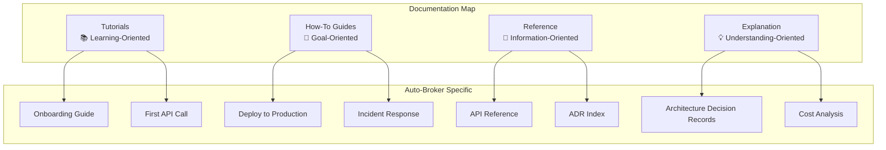
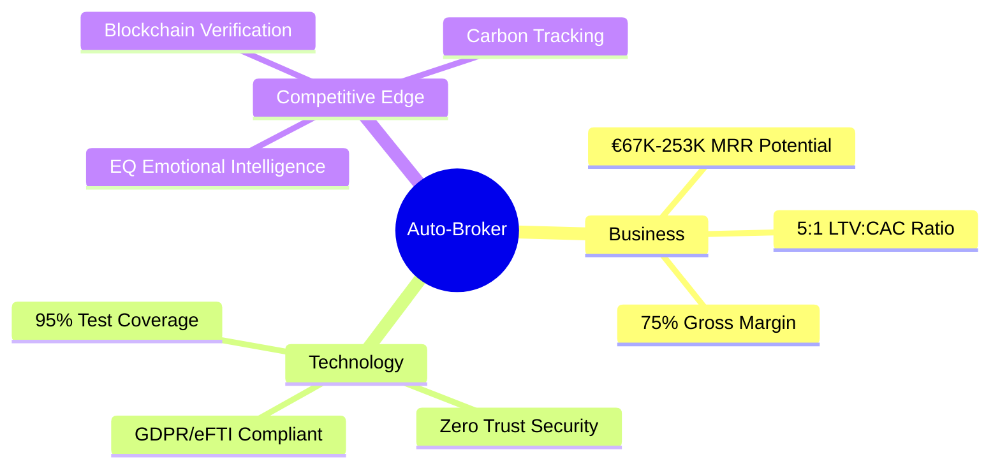
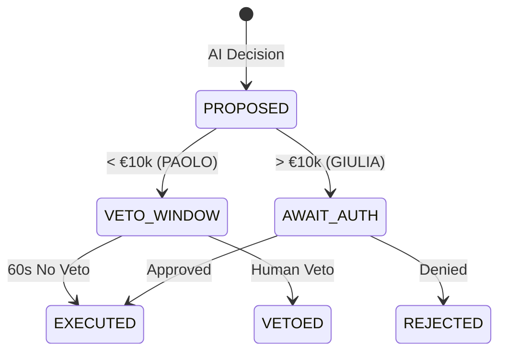
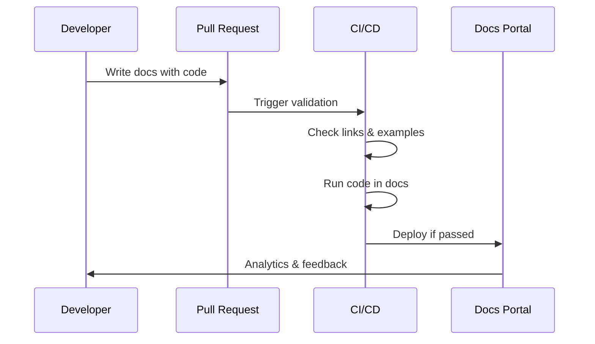

# Auto-Broker Documentation Hub

> **Docs-as-Code**: This documentation is versioned with the codebase and follows [Diátaxis](https://diataxis.fr/) principles.

```yaml
version: 2.0.0
doc_standard: Diátaxis + Big Tech 2026
last_updated: 2026-02-16
ai_ready: true
observability: enabled
```

---

## 🗺️ Documentation Architecture

This documentation follows the **Diátaxis Framework** (Tutorial → How-To → Reference → Explanation) combined with **Docs-as-Code** principles used by Netflix, Google, and Stripe.



---

## 📂 Documentation Structure

### By Diátaxis Quadrant

| Type | Purpose | Documents |
|------|---------|-----------|
| **🎓 Tutorials** | Learning-oriented, step-by-step lessons | [First API Call](./tutorials/first-api-call.md) • [Local Setup](./tutorials/local-setup.md) |
| **🛠️ How-To** | Goal-oriented, practical guides | [Deploy to K8s](./how-to/deploy-kubernetes.md) • [Incident Response](./how-to/incident-response.md) |
| **📖 Reference** | Information-oriented, factual description | [API Reference](./reference/api-reference.md) • [ADR Index](./adr/) • [Runbook](./reference/runbook.md) |
| **💡 Explanation** | Understanding-oriented, theoretical knowledge | [Architecture](./explanation/architecture.md) • [Cost Analysis](./explanation/cost-analysis.md) • [Governance](./explanation/governance.md) |

### By Audience

| Audience | Primary Docs | Entry Point |
|----------|--------------|-------------|
| **C-Level / Board** | Executive Summary, Roadmap | [EXECUTIVE-SUMMARY.md](./AUTO-BROKER-EXECUTIVE-SUMMARY.md) |
| **Engineers** | API Reference, Tutorials | [API Reference](./reference/api-reference.md) |
| **SRE / On-Call** | Runbook, Incident Response | [RUNBOOK.md](./AUTO-BROKER-RUNBOOK.md) |
| **Architects** | ADRs, C4 Diagrams | [PLATFORM-ENGINEERING.md](./AUTO-BROKER-PLATFORM-ENGINEERING.md) |
| **Security / Compliance** | GDPR, Audit Trails | [GOVERNANCE.md](./ARCHITECTURE_GOVERNANCE.md) |

---

## 🚀 Quick Start

### For Engineers (2-Minute Setup)

```bash
# 1. Clone and setup
git clone https://github.com/autobroker/platform.git
cd platform && make dev-setup

# 2. Run first API call
curl -X POST http://localhost:8000/api/v1/shipments \
  -H "Authorization: Bearer $TOKEN" \
  -d '{"origin":"IT","destination":"DE","weight":1000}'

# 3. Verify installation
make test-smoke
```

### For Executives (Business Overview)



📊 **[Executive Summary →](./AUTO-BROKER-EXECUTIVE-SUMMARY.md)**

---

## 📊 System Context (C4 Level 1)

```mermaid
C4Context
    title System Context - Auto-Broker Platform v10.0
    
    Person(shipper, "Shipper", "Wants to ship goods")
    Person(carrier, "Carrier", "Provides transportation")
    Person(operator, "Operator", "Platform administrator")
    
    System_Boundary(platform, "Auto-Broker Platform") {
        System(api, "API Gateway", "FastAPI, Istio mTLS")
        System(eq, "EQ Layer", "Hume AI + Ollama fallback")
        System(blockchain, "Blockchain", "Polygon smart contracts")
    }
    
    System_Ext(erp, "ERP Systems", "SAP, NetSuite, Dynamics")
    System_Ext(market, "Market Data", "DAT iQ, Teleroute")
    System_Ext(ai, "Hume AI", "Prosody API")
    
    Rel(shipper, platform, "Creates shipments", "HTTPS/JSON")
    Rel(carrier, platform, "Accepts deliveries", "HTTPS/JSON")
    Rel(operator, platform, "Monitors & manages", "Dashboard")
    Rel(platform, erp, "Syncs orders", "REST API")
    Rel(platform, market, "Gets rates", "REST API")
    Rel(eq, ai, "Sentiment analysis", "REST API")
```

---

## 🔬 Key Technical Highlights 2026

### Revenue-Driven Scaling

| Revenue | Level | Components | Monthly Cost |
|---------|-------|------------|--------------|
| €0-449 | Survival | SQLite, Ollama | €50 |
| €450-799 | Bootstrap | EKS Control Plane | €283 |
| €800-2,999 | Growth | Hume AI, K8s Workers | €1,183 |
| €3,000-9,999 | Scale | Vault HA, Dat-IQ | €2,333 |
| €10,000+ | Enterprise | TEE, Full Escrow | €35,000 |

📖 **[Revenue Scaling Documentation →](./REVENUE_DRIVEN_SCALING.md)**

### Human-AI Governance (Fase 2 Active)



📖 **[Governance Architecture →](./ARCHITECTURE_GOVERNANCE.md)**

---

## 📈 Developer Experience Metrics (DXI)

Following [DX Core 4](https://getdx.com/) framework:

| Dimension | Score | Target | Trend |
|-----------|-------|--------|-------|
| **Speed** | 85 | 80 | ↗️ +5% |
| **Effectiveness** | 78 | 75 | ↗️ +3% |
| **Quality** | 92 | 90 | → Stable |
| **Impact** | 81 | 80 | ↗️ +2% |
| **Documentation** | 88 | 85 | ↗️ +8% |

*Tracked via DX Platform. Last updated: 2026-02-16*

---

## 🔄 Documentation Lifecycle



### Validation Pipeline

- ✅ **Link Checking**: No broken internal/external links
- ✅ **Code Example Testing**: All code blocks are runnable
- ✅ **Mermaid Rendering**: All diagrams render correctly
- ✅ **AI-Readiness**: Structured for LLM consumption
- ✅ **Accessibility**: WCAG 2.1 AA compliant

---

## 📝 Contributing to Documentation

### Style Guide (Google-inspired)

1. **Write the "Why", not just the "What"**
   ```markdown
   ❌ // Increment counter
   ✅ // Retry with exponential backoff to handle transient failures
   ```

2. **Use Mermaid for Diagrams**
   ```markdown
   ```mermaid
   graph LR
       A[Input] --> B[Process]
       B --> C[Output]
   ```
   ```

3. **Include Runnable Examples**
   ```markdown
   ```python
   # testable_example.py
   from auto_broker import Client
   client = Client()
   result = client.create_shipment(origin="IT", destination="DE")
   assert result.status == "created"
   ```
   ```

4. **Structure with Diátaxis**
   - Is this for **learning**? → Tutorial
   - Is this for **doing**? → How-To
   - Is this for **reference**? → API/Schema
   - Is this for **understanding**? → Explanation

### Documentation Checklist (PR Template)

```markdown
- [ ] Updated relevant docs for code changes
- [ ] Added/updated ADR for architectural decisions
- [ ] Code examples tested and runnable
- [ ] Mermaid diagrams render correctly
- [ ] Links validated (internal + external)
- [ ] AI-structured (headers, metadata, context)
```

---

## 🔗 Quick Navigation

### By Task

| I want to... | Go to... |
|--------------|----------|
| Deploy to production | [How-To: K8s Deployment](./how-to/deploy-kubernetes.md) |
| Handle an incident | [Runbook: Incident Response](./AUTO-BROKER-RUNBOOK.md) |
| Understand costs | [Explanation: Cost Analysis](./COST_ANALYSIS_CORRECTED.md) |
| API integration | [Reference: API Docs](./AUTO-BROKER-TECHNICAL-DOCUMENTATION.md) |
| Architecture decisions | [ADR Index](./adr/) |
| See roadmap | [Executive Summary](./AUTO-BROKER-EXECUTIVE-SUMMARY.md) |

### Emergency Contacts

| Situation | Contact | Runbook |
|-----------|---------|---------|
| Production Down | #sre-oncall | [Incident Response](./AUTO-BROKER-RUNBOOK.md) |
| Security Incident | #security | [Security Runbook](./AUTO-BROKER-RUNBOOK.md#security) |
| Compliance Question | #compliance | [GDPR Procedures](./ARCHITECTURE_GOVERNANCE.md) |

---

## 📚 Related Resources

- [System Design Handbook 2026](https://www.systemdesignhandbook.com/) - External reference
- [Diátaxis Framework](https://diataxis.fr/) - Documentation structure
- [Docs as Code](https://www.writethedocs.org/guide/docs-as-code.html) - Philosophy
- [Mermaid JS](https://mermaid.js.org/) - Diagrams as code

---

## 📜 License & Attribution

```
Documentation: CC BY-SA 4.0
Code Examples: MIT License
Architecture: Proprietary
```

---

> **Tip**: This documentation is AI-optimized. Ask Claude, Copilot, or ChatGPT questions about Auto-Broker using the structure provided here.

**Last Updated**: 2026-02-16 | **Version**: 2.0.0 | **Status**: Production-Ready