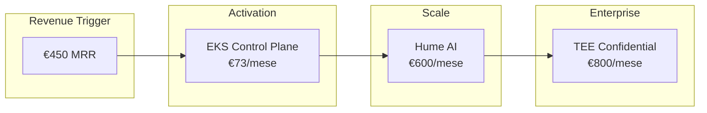
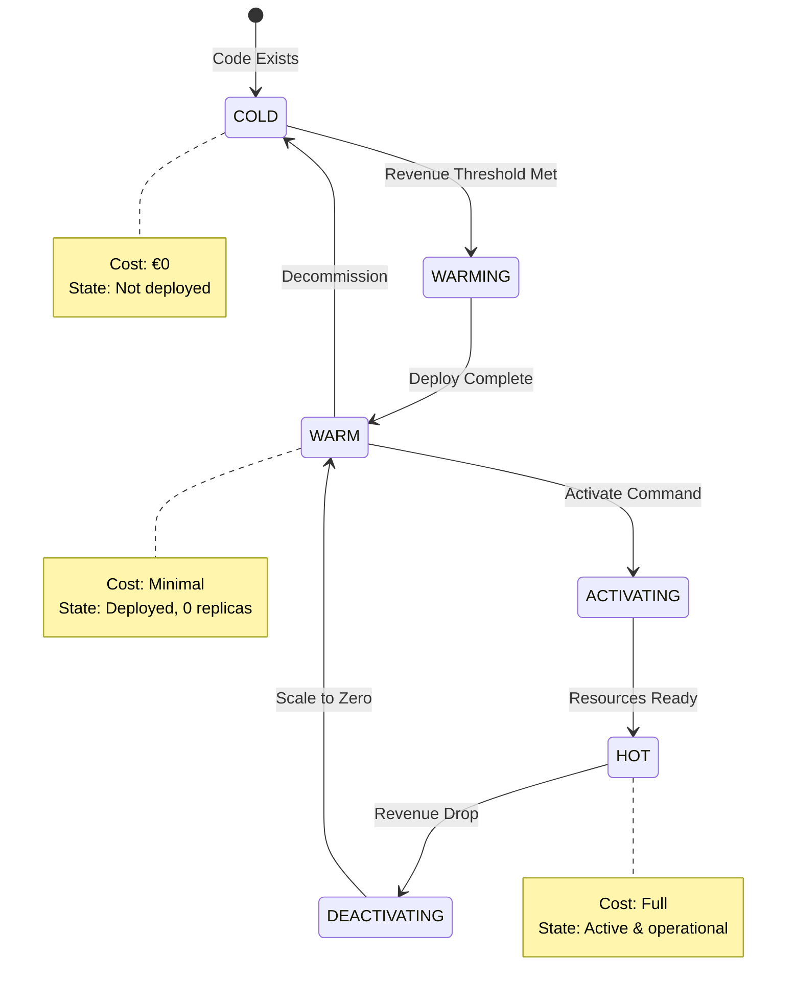
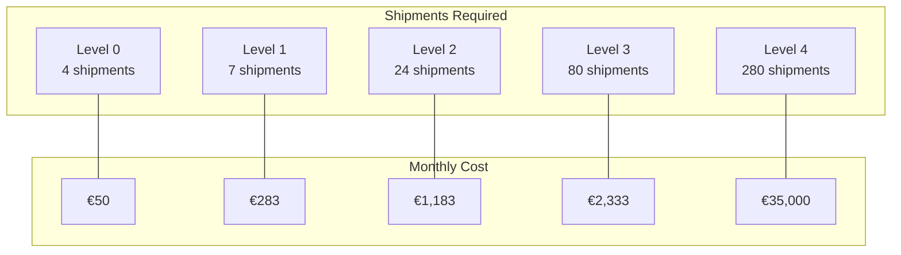
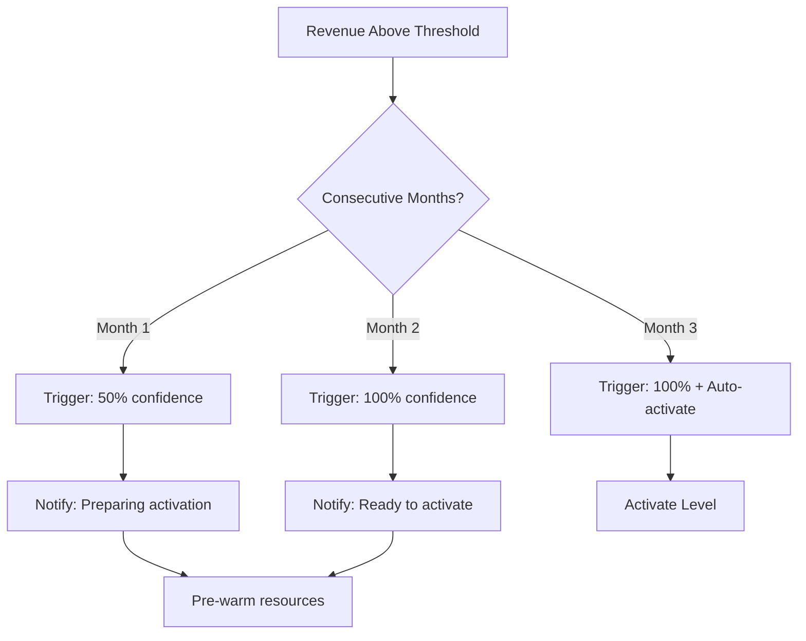
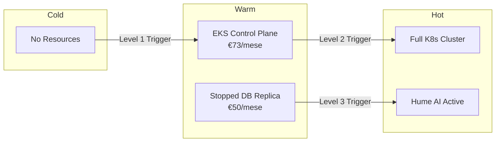
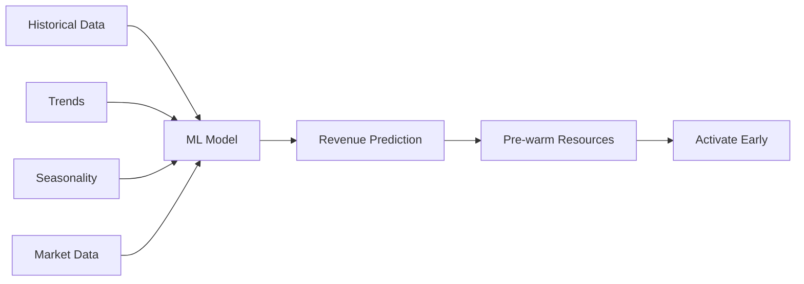

# Revenue-Driven Progressive Scaling

```yaml
document_type: explanation
version: 2.0.0
date: 2026-02-16
audience: [architects, tech_leads, executives, finance]
ai_ready: true
related_adrs: [ADR-017]
slos:
  revenue_calculation_accuracy: 99.99%
  activation_latency_p99: <300s
  cost_tracking_precision: 6_decimals
```

---

## 🎯 At a Glance

Auto-Broker's infrastructure **activates only when revenue justifies it**. From €50/month (bootstrap) to €35K/month (enterprise), every component scales with your MRR.



**Core Principle**: *No cost without corresponding revenue*

---

## 🏗️ Economic Levels

### The 5-Level Model

```mermaid
gantt
    title Revenue Levels & Activation Timeline
    dateFormat  X
    axisFormat %s
    
    section Level 0
    Survival    :0, 449
    
    section Level 1  
    Bootstrap   :450, 799
    
    section Level 2
    Growth      :800, 2999
    
    section Level 3
    Scale       :3000, 9999
    
    section Level 4
    Enterprise  :10000, 35000
```



| Level | Revenue Range | Max Burn | Debounce | Key Components |
|-------|--------------|----------|----------|----------------|
| **0** Survival | €0 - €449 | €450 | N/A | SQLite, Ollama offline |
| **1** Bootstrap | €450 - €799 | €800 | 1 month | EKS Control Plane (€73) |
| **2** Growth | €800 - €2,999 | €3,000 | 2 months | Hume AI (€600), K8s Workers |
| **3** Scale | €3,000 - €9,999 | €10,000 | 2 months | Vault HA, Dat-IQ, Redis Cluster |
| **4** Enterprise | €10,000+ | €35,000 | 3 months | TEE Confidential, Full Escrow |

### Resource State Lifecycle



---

## 💰 Cost Breakdown by Level

### Level 0: Survival Mode (€0-449 MRR)

```yaml
level_0_survival:
  monthly_cost_eur: 50
  components:
    - sqlite_local        # €0
    - ollama_cpu          # €0 (offline)
    - single_vps          # €50
  disabled:
    - kubernetes
    - hume_ai
    - tee_confidential
```

| Component | Cost | Note |
|-----------|------|------|
| SQLite (local) | €0 | File-based database |
| Ollama (CPU) | €0 | Offline inference |
| Single VPS | €50 | t3.micro equivalent |
| **Total** | **€50** | 89% margin for team/tools |

### Level 1: Bootstrap (€450-799 MRR)

```yaml
level_1_bootstrap:
  monthly_cost_eur: 283
  delta_from_previous: 233
  components:
    eks_control_plane: 73
    rds_single: 150
    elasticache_single: 30
    ecr_storage: 10
    alb: 20
```

| Component | Cost | Justification |
|-----------|------|---------------|
| EKS Control Plane | €73 | K8s orchestration |
| RDS Single (db.t3) | €150 | Managed PostgreSQL |
| ElastiCache Single | €30 | Session cache |
| ECR Storage | €10 | Container registry |
| ALB | €20 | Load balancer |
| **Total** | **€283** | €517 buffer |

**Break-even**: 7 spedizioni/mese @ 25% margin

### Level 2: Growth (€800-2,999 MRR)

```yaml
level_2_growth:
  monthly_cost_eur: 1183
  delta_from_previous: 900
  components:
    eks_workers_spot: 150
    hume_ai_budget: 600
    s3_cloudfront: 100
    waf: 50
    level_1_carryover: 283
```

| Component | Cost | Details |
|-----------|------|---------|
| EKS Workers (Spot) | €150 | 3x t3.medium @ €0.05/hr |
| Hume AI | €600 | 4000 min @ €0.15/min |
| S3 + CloudFront | €100 | CDN for static assets |
| WAF | €50 | Web application firewall |
| Level 1 Base | €283 | Carried forward |
| **Total** | **€1,183** | €1,817 buffer |

**Break-even**: 24 spedizioni/mese @ 25% margin

### Level 3: Scale (€3,000-9,999 MRR)

```yaml
level_3_scale:
  monthly_cost_eur: 2333
  delta_from_previous: 1150
  components:
    vault_ha: 200
    dat_iq_integration: 500
    rds_multi_az: 150
    redis_cluster: 300
    level_2_carryover: 1183
```

| Component | Cost | Purpose |
|-----------|------|---------|
| Vault HA | €200 | Secret management HA |
| Dat-IQ | €500 | Market data integration |
| RDS Multi-AZ | +€150 | HA database |
| Redis Cluster | €300 | Distributed cache |
| Level 2 Base | €1,183 | Carried forward |
| **Total** | **€2,333** | €7,667 buffer |

**Break-even**: 80 spedizioni/mese @ 25% margin

### Level 4: Enterprise (€10,000+ MRR)

```yaml
level_4_enterprise:
  monthly_cost_eur: 35000
  delta_from_previous: 32667
  components:
    tee_confidential: 800
    carrier_escrow_full: 300
    advanced_monitoring: 200
    gdpr_compliance_suite: 800
    level_3_carryover: 2333
    additional_infrastructure: 30667
```

| Component | Cost | Enterprise Feature |
|-----------|------|-------------------|
| TEE Confidential | €800 | AMD SEV-SNP/Intel TDX |
| CarrierEscrow Full | €300 | Complete escrow |
| Advanced Monitoring | €200 | Custom dashboards |
| GDPR Compliance | €800 | Complete suite |
| Infrastructure | €30,667 | Scale-out resources |
| Level 3 Base | €2,333 | Carried forward |
| **Total** | **€35,000** | |

**Break-even**: 280 spedizioni/mese @ 25% margin

---

## 📊 Break-Even Analysis

### Formula

```
break_even_shipments = total_monthly_cost / profit_per_shipment

Where:
- profit_per_shipment = avg_shipment_value × margin
- Example: €500 × 25% = €125 profit/shipment
```

### Break-Even Matrix



| Level | Max Burn | Break-Even (25% margin) | Buffer |
|-------|----------|------------------------|--------|
| 0 | €450 | 4 spedizioni | 89% |
| 1 | €800 | 7 spedizioni | 65% |
| 2 | €3,000 | 24 spedizioni | 61% |
| 3 | €10,000 | 80 spedizioni | 77% |
| 4 | €35,000 | 280 spedizioni | 0% (max) |
| **Full Burn** €56.7k | | **454 spedizioni** | |

---

## 🔒 Safety Mechanisms

### 1. Cost-Revenue Ratio Check

```python
async def validate_activation(level_id: str, metrics: RevenueMetrics) -> ValidationResult:
    """
    Emergency brake: prevent activation if cost > 90% of revenue.
    """
    config = await get_level_config(level_id)
    level_cost = config.max_monthly_burn
    current_mrr = metrics.mrr
    
    ratio = level_cost / current_mrr
    
    if ratio > 0.90:
        return ValidationResult(
            allowed=False,
            reason=f"Cost {level_cost} exceeds 90% of MRR {current_mrr}",
            ratio=ratio,
            requires_manual_override=True
        )
    
    return ValidationResult(allowed=True, ratio=ratio)
```

### 2. Debounce Logic



| Level | Required Consecutive Months | Confidence Build-up |
|-------|---------------------------|-------------------|
| 1 | 1 | Immediate |
| 2 | 2 | 50% → 100% |
| 3 | 2 | 50% → 100% |
| 4 | 3 | 33% → 66% → 100% |

### 3. Pre-Warming Strategy



**Pre-warming benefits**:
- Reduce activation latency from 15 min to 2 min
- Pay only for control plane (€73) not workers
- Maintain deployment history and config

---

## 🔧 Implementation

### RevenueMonitorService

```python
class RevenueMonitorService:
    """
    Tracks MRR in real-time and triggers level activation.
    """
    
    async def calculate_mrr(self) -> Decimal:
        """Calculate Monthly Recurring Revenue from payments."""
        payments = await self.db.payments.filter(
            status='completed',
            created_at__gte=timezone.now() - timedelta(days=30)
        )
        return sum(p.amount for p in payments)
    
    async def check_triggers(self) -> List[ActivationTrigger]:
        """Check all level triggers."""
        metrics = await self.calculate_metrics()
        triggers = []
        
        for level_id, config in LEVELS.items():
            trigger = await self.evaluate_trigger(
                level_id=level_id,
                config=config,
                metrics=metrics
            )
            if trigger.confidence > 0:
                triggers.append(trigger)
        
        return triggers
```

### ProvisioningOrchestrator

```python
class ProvisioningOrchestrator:
    """
    Manages physical resource activation.
    """
    
    async def activate_level(
        self,
        level_id: str,
        dry_run: bool = False
    ) -> ProvisioningResult:
        """
        Activate all components for a level.
        
        Args:
            level_id: Target level (level_1_bootstrap, etc)
            dry_run: If True, simulate without executing
            
        Returns:
            ProvisioningResult with component status
        """
        config = await self.get_config(level_id)
        
        # Safety check
        if not dry_run:
            validation = await self.validate_safety(level_id)
            if not validation.passed:
                raise SafetyError(validation.reason)
        
        # Activate components
        results = []
        for component in config.components:
            if dry_run:
                result = await self.simulate_activation(component)
            else:
                result = await self.activate_component(component)
            results.append(result)
        
        return ProvisioningResult(
            level_id=level_id,
            components=results,
            dry_run=dry_run
        )
```

---

## 📡 API Reference

### Simulate Revenue Scenario

```http
POST /api/v1/economics/simulate
Authorization: Bearer ${TOKEN}

{
  "projected_mrr": 5000,
  "projected_growth_rate": 0.15
}
```

**Response**
```json
{
  "current_level": "level_1_bootstrap",
  "simulated_level": "level_2_growth",
  "triggers": [
    {
      "level_id": "level_2_growth",
      "triggered": false,
      "confidence": 0.5,
      "reason": "Need 2 consecutive months above €800",
      "consecutive_months_met": 1,
      "estimated_activation": "2026-03-15"
    }
  ],
  "projected_costs": {
    "current": 283,
    "simulated": 1183,
    "delta": 900
  },
  "break_even_analysis": {
    "shipments_needed": 24,
    "margin_at_risk": 0.05
  }
}
```

### Get Current Level

```http
GET /api/v1/economics/current-level
Authorization: Bearer ${TOKEN}
```

**Response**
```json
{
  "level_id": "level_1_bootstrap",
  "level_name": "Bootstrap Mode",
  "mrr": 650,
  "max_burn": 800,
  "cost_ratio": 0.44,
  "active_components": [
    "eks_control_plane",
    "rds_single"
  ],
  "disabled_components": [
    "hume_ai",
    "vault_ha"
  ],
  "next_level": {
    "id": "level_2_growth",
    "threshold": 800,
    "progress": 0.81
  }
}
```

---

## 📈 Monitoring & Alerting

### Prometheus Metrics

```prometheus
# Revenue metrics
revenue_mrr_gauge{level="current"} 650
revenue_growth_rate 0.15
revenue_projected_3m 1200

# Scaling metrics
scaling_level_current 1
scaling_cost_ratio 0.44
scaling_activation_timestamp{level="1"} 1708137600

# Component states
component_state{component="eks",state="warm"} 1
component_state{component="hume_ai",state="cold"} 1

# Safety metrics
scaling_safety_check_passed_total 47
scaling_safety_check_blocked_total 2
```

### Alerting Rules

```yaml
groups:
  - name: revenue_scaling
    rules:
      - alert: CostApproachingRevenue
        expr: revenue_cost_ratio > 0.80
        for: 5m
        labels:
          severity: warning
        annotations:
          summary: "Cost approaching 80% of revenue"
          
      - alert: CostExceedsSafeThreshold
        expr: revenue_cost_ratio > 0.90
        for: 1m
        labels:
          severity: critical
        annotations:
          summary: "EMERGENCY: Cost exceeds 90% of revenue"
          
      - alert: RevenueDropping
        expr: revenue_growth_rate < -0.20
        for: 1h
        labels:
          severity: warning
        annotations:
          summary: "Revenue dropping >20% month-over-month"
```

---

## 🚀 Future Enhancements

### ML-Based Forecasting



### Spot Instance Bidding

- Dynamic pricing for K8s workers
- Cost reduction 60-70% vs on-demand
- Automatic fallback to on-demand if spot unavailable

### Cross-Region Scaling

- Multi-region activation for DR
- Geographic load balancing
- Regional compliance (GDPR, etc)

---

## 📚 References

### Internal
- [ADR-017: Revenue-Driven Scaling](./adr/ADR-017-revenue-driven-scaling.md)
- [Cost Analysis Corrected](./COST_ANALYSIS_CORRECTED.md)
- [ProvisioningOrchestrator](../api/services/provisioning_orchestrator.py)

### External
- [AWS EKS Pricing](https://aws.amazon.com/eks/pricing/)
- [Hume AI Pricing](https://hume.ai/pricing)
- [Stripe Atlas: Runway Calculator](https://stripe.com/atlas/guides/runway)

---

```yaml
metadata:
  version: 2.0.0
  last_updated: 2026-02-16
  owner: platform-team@autobroker.com
  approvers: [cto, cfo]
  next_review: 2026-03-16
  
metrics:
  reading_time_minutes: 20
  code_examples: 4
  diagrams: 8
  api_endpoints: 2
```