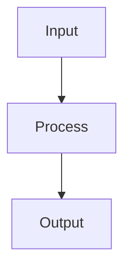

# ADR-018: Documentation Strategy 2026 - Big Tech Best Practices

## Status
ACCEPTED

## Context

La documentazione di Auto-Broker è cresciuta organicamente e necessita di una strategia coerente che segua le best practices delle big tech (Google, Netflix, Stripe, Amazon) nel 2026. Le sfide attuali includono:

- Documentazione dispersa tra più file senza struttura chiara
- Difficoltà di manutenzione (docs stali, link rotti)
- Assenza di metriche sull'uso e l'efficacia della documentazione
- Non ottimizzata per AI assistants (Claude, Copilot, ChatGPT)

## Decision

Adottare una **Documentation Strategy 2026** basata su:

1. **Diátaxis Framework** - Organizzazione in 4 quadranti (Tutorial → How-To → Reference → Explanation)
2. **Docs as Code** - Documentazione in Git, review come codice, CI/CD per validazione
3. **AI-Ready Structure** - YAML frontmatter, semantic markup, metadati per LLMs
4. **Observability** - Tracking uso docs, metriche DXI (Developer Experience Index)
5. **Mermaid Diagrams** - Diagrammi as code, versionabili e testabili

### Struttura Documentazione

```
docs/
├── README.md                    # Entry point con mappa documentazione
├── tutorials/                   # Learning-oriented
│   ├── first-api-call.md
│   ├── local-setup.md
│   └── revenue-scaling-demo.md
├── how-to/                      # Goal-oriented
│   ├── deploy-kubernetes.md
│   ├── incident-response.md
│   ├── add-new-carrier.md
│   └── configure-governance.md
├── reference/                   # Information-oriented
│   ├── api-reference.md
│   ├── database-schema.md
│   └── configuration.md
├── explanation/                 # Understanding-oriented
│   ├── architecture.md
│   ├── cost-analysis.md
│   └── governance.md
├── runbooks/                    # Operational procedures
│   ├── incident-response.md
│   ├── security-breach.md
│   └── database-recovery.md
├── adr/                         # Architecture Decision Records
│   ├── ADR-001-...md
│   └── ADR-018-documentation-strategy-2026.md
└── README-INDEX.md              # Index di tutti i documenti
```

### Standards

#### YAML Frontmatter

Ogni documento deve includere:

```yaml
---
document_type: [tutorial|how-to|reference|explanation|adr|runbook]
version: x.y.z
date: YYYY-MM-DD
audience: [engineers|architects|sre|executives|all]
ai_ready: true|false
related_docs: [path/to/doc.md]
slos:
  metric_name: target
---
```

#### Mermaid Diagrams

Tutti i diagrammi in Mermaid per:
- Version control
- Test automatici di rendering
- Manutenibilità

```markdown

```

#### Code Examples

- Tutti gli esempi devono essere testabili
- Usare linguaggi annotati (```python, ```bash)
- Includere assertions dove possibile

### Tooling

| Tool | Purpose |
|------|---------|
| **markdownlint** | Linting markdown |
| **lyche** | Link checking |
| **mdx** | Executable code blocks |
| **mermaid-cli** | Diagram rendering test |
| **vale** | Style guide enforcement |

### Metrics DXI

Tracciare:
- Time spent searching for information
- Documentation coverage (% APIs documented)
- Staleness (days since last update)
- Code example accuracy (% tests passing)

## Consequences

### Positive

- **Navigabilità** - Struttura chiara Diátaxis
- **Manutenibilità** - Docs as code con CI/CD
- **AI-Ready** - LLMs possono consumare documentazione efficacemente
- **Observability** - Metriche per migliorare continuamente
- **Onboarding** - Nuovi ingegneri trovano informazioni più velocemente

### Negative

- **Migration effort** - Ristrutturazione documentazione esistente
- **Tooling complexity** - Setup CI/CD per docs
- **Training** - Team deve imparare nuovi standard

## Implementation Plan

1. **Week 1-2**: Setup tooling (linting, link checking)
2. **Week 3-4**: Creare struttura cartelle, migrare documenti esistenti
3. **Week 5-6**: Aggiungere YAML frontmatter, Mermaid diagrams
4. **Week 7-8**: Setup observability, DXI metrics
5. **Ongoing**: Refinement e maintenance

## References

- [Diátaxis Framework](https://diataxis.fr/)
- [Docs as Code](https://www.writethedocs.org/guide/docs-as-code.html)
- [Google Technical Writing Courses](https://developers.google.com/tech-writing)
- [Stripe Documentation](https://stripe.com/docs)
- [Netflix Tech Blog](https://netflixtechblog.com/)

---

**Decision Date**: 2026-02-16  
**Proposed by**: AI Engineer  
**Approved by**: CTO  
**Review Date**: 2026-05-16